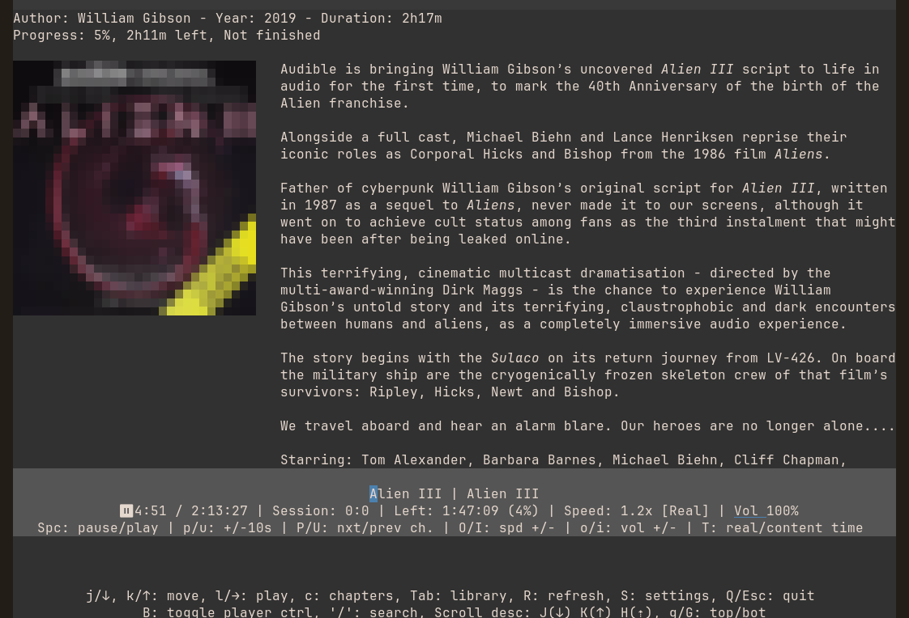

[](https://github.com/pdwaldrop/Absotui/releases/latest)
[](https://github.com/pdwaldrop/Absotui/actions/workflows/release.yml)

# 🦜 Absotui: A TUI Audiobookshelf client for Linux and macOS

<p align="center">
    <em>"ABS" (Audiobookshelf) + "TUI" (terminal user interface) — read it like "absolutely."</em>
</p>

<p align="center">
    
</p>

<p align="center">
    A fast, keyboard-driven terminal client for your self-hosted <a href="https://www.audiobookshelf.org/">Audiobookshelf</a> server —
    browse your library, track chapters, and keep listening progress in sync, all without leaving the terminal.
</p>

<div align="center">
🎨 Explore and try various themes <a href="https://github.com/AlbanDAVID/Toutui-theme">here</a>.
</div>

## ✨ Foundation
 **Cross-platform:**   Linux and  macOS    
 **Lightweight & Fast:** A minimalist terminal user interface (TUI) written in Rust 🦀  
 **Supports Books & Podcasts:** Enjoy both audiobooks and podcasts  
 **Streaming Support:** Play directly without downloading  
 **Customizable Color Theme:** A config file lets you customize the color theme, including the progress indicator color

## 🚀 Built in Absotui
 **Podcast Home, Reworked:** A unified "New & Unfinished" view merges Continue Listening and newest episodes, actively filtered by real finished status  
 **Podcast Autoplay:** Automatically start the next unfinished episode when one finishes  
 **Mark Finished:** Instantly mark an episode finished (`F`) without waiting for it to play through — including the one currently playing  
 **At-a-Glance Progress:** Per-book progress bars and a now-playing marker, right in the Continue Listening list  
 **Cover Art:** Book and podcast episode cover art shown alongside the description (terminal permitting — Kitty/Sixel/iTerm2), preferring a podcast episode's own embedded artwork over the podcast's cover when the episode's file has one  
 **Chapter Navigation:** Browse a book's full chapter list inline in Continue Listening, with live per-chapter progress  
 **Per-Item Playback Speed:** Optionally (Settings > Per-Item Speed) let each book or podcast show remember its own playback speed instead of sharing one speed across everything  
 **Volume Indicator:** See where the player's volume sits at a glance, shown as a subtle underline in the player bar  
 **Speed-Adjusted Time Display:** Toggle (`T` key) between real elapsed/remaining time and raw content time  
 **Accurate Sync:** Progress percentages stay correct even at non-1x playback speeds  
 **Recovers From a Down Server:** A clear retry/change-server screen instead of the app just closing when it can't reach Audiobookshelf  
 **Desktop Integration:** A custom app icon, its own taskbar/dock window icon (on supported terminals), and a window title that shows what's currently playing

## 🛠️ Roadmap  
Recent work: a recovery screen when the Audiobookshelf server can't be reached, instead of the app just closing; fixed marking the currently-playing podcast episode as finished (it used to revert itself and keep playing); fixed login sometimes needing two attempts; fixed the installer silently dropping custom `config.toml` settings on update. See "Future features" below for what's being considered next, and [known bugs](known_bugs.md) for what's still outstanding.

## 🔮 Future features
Here are some features that could be added in future releases:
- Playlist/Collections view
- Ability to add new podcasts from the app
- Add stats
- Offline mode
  
## ⚠️ Caution: Beta Version  
This app is still in **heavy development and contains bugs**.  
❗Please check [here](known_bugs.md) for known bugs especially **MAJOR BUGS** before using the app, so you can use it with full awareness of any known issues.  
If you encounter any issues that are **not yet listed** in the Issues section or [known bugs](known_bugs.md), please **open a new issue** to report them.  

🔐 Although it's a beta version, you can use this app with **minimal risk** to your Audiobookshelf library.  
At worst, you may experience **sync issues**, but there is **no risk** of data loss, deletion, or irreversible changes (API is just used to retrieve books and sync them).

## 📝 Notes
### 🐛 **Issues**    
For any issues, check first the [issues](https://github.com/pdwaldrop/Absotui/issues) here. Otherwise, open a new one. (Also worth checking the [original project's wiki](https://github.com/AlbanDAVID/Toutui/wiki/) for general usage help, since most of the underlying app hasn't changed yet.)

### 🤝 **Contributing**  
Do not hesitate to contribute to this project by submitting your code, ideas, or feedback. Please make sure to read the [contributing guidelines](CONTRIBUTING.md) first.

### 🔁 Branching workflow 
This project follows this [branching workflow](https://gist.github.com/digitaljhelms/4287848). 

### 🎨 **UI**
Explore and share themes [here](https://github.com/AlbanDAVID/Toutui-theme).    
The **font** and **emojis** may vary depending on the terminal you are using.    
To ensure the best experience, it's recommended to use **Kitty** or **Alacritty** terminal.

### 🙏 Credits
Absotui began as a fork of [Toutui](https://github.com/AlbanDAVID/Toutui) by [AlbanDAVID](https://github.com/AlbanDAVID), archived in December 2025 ("I'm not able to properly maintain this project anymore... please don't wait for any new releases and issue fixing."). Thanks to the original author for the foundation this project builds on. Toutui itself took its name from the French phrase "tout ouïe" ("all ears").

## 🚨 Installation Instructions

>[!WARNING]
> - **This is a beta app, please read [this](#%EF%B8%8F-caution-beta-version).**
>  - For any issues, check first the [issues](https://github.com/pdwaldrop/Absotui/issues) here. Otherwise, open a new one.

>[!NOTE]
> There's no AUR package for this fork yet, so `yay`/pacman won't pick up Absotui updates - use the install script below (or `absotui --update`) instead. Prebuilt binaries (Linux x86_64/aarch64, macOS universal) are available via the install script's Option 1.

### ⚡ Easy installation (install script)

**Run the following in your terminal, then follow the on-screen instructions:**    

```bash
bash -c 'tmpfile=$(mktemp) && curl -LsSf https://github.com/pdwaldrop/Absotui/raw/stable/hello_absotui.sh -o "$tmpfile" && bash "$tmpfile" install && rm -f "$tmpfile"'
```

#### **Update**

Run `absotui --update`, or quit the app and run the following in your terminal:

```bash
bash -c 'tmpfile=$(mktemp) && curl -LsSf https://github.com/pdwaldrop/Absotui/raw/stable/hello_absotui.sh -o "$tmpfile" && bash "$tmpfile" update && rm -f "$tmpfile"'
```

#### **Uninstall**

Run `absotui --uninstall`, or quit the app and run the following in your terminal:

```bash
bash -c 'tmpfile=$(mktemp) && curl -LsSf https://github.com/pdwaldrop/Absotui/raw/stable/hello_absotui.sh -o "$tmpfile" && bash "$tmpfile" uninstall && rm -f "$tmpfile"'
```

#### **Notes**  

##### Files installed:
In `/usr/local/bin` (option 1, from install script) or `~/.cargo/bin` (option 2, from install script):
- `absotui` - The binary file.

In `~/.config/absotui` for Linux or `~/Library/Preferences` for macOS:    
**Note**: This is the default path if `XDG_CONFIG_HOME` is empty. 
- `.env` - Contains the secret key.
- `config.toml` - Configuration file.
- `absotui.log` - Log file.
- `db.sqlite3` - SQLite database file.

In `~/.local/share/applications` for Linux:
- `absotui.desktop` - Config file to launch Absotui from a launcher app.

### Install from source

>[!WARNING]
> This is a beta app, please read [this](#%EF%B8%8F-caution-beta-version).  

#### **Requirements**
- `Rust`
- `Netcat`
- `VLC`

Note: `main` might be unstable. Prefer `git clone --branch stable --single-branch https://github.com/pdwaldrop/Absotui` if you want the last stable release.    
```bash
git clone https://github.com/pdwaldrop/Absotui
cd Absotui/
mkdir -p ~/.config/absotui
cp config.example.toml ~/.config/absotui/config.toml
```

Token encryption in the database (<u>**NOTE**</u>: replace `secret`)
```bash
echo ABSOTUI_SECRET_KEY=secret >> ~/.config/absotui/.env
```

```bash
cargo run --release
```

#### **Update**

When a new release is available, follow these steps:

```bash
git pull https://github.com/pdwaldrop/Absotui
cargo run --release
```

#### **Notes**  
##### Exec the binary:
```bash
cd target/release
./absotui
```

##### Files installed:
After installation, you will have the following files in `~/.config/absotui`
- `.env` - Contains the secret key.
- `config.toml` - Configuration file.
- `absotui.log` - Log file.
- `db.sqlite3` - SQLite database file.
