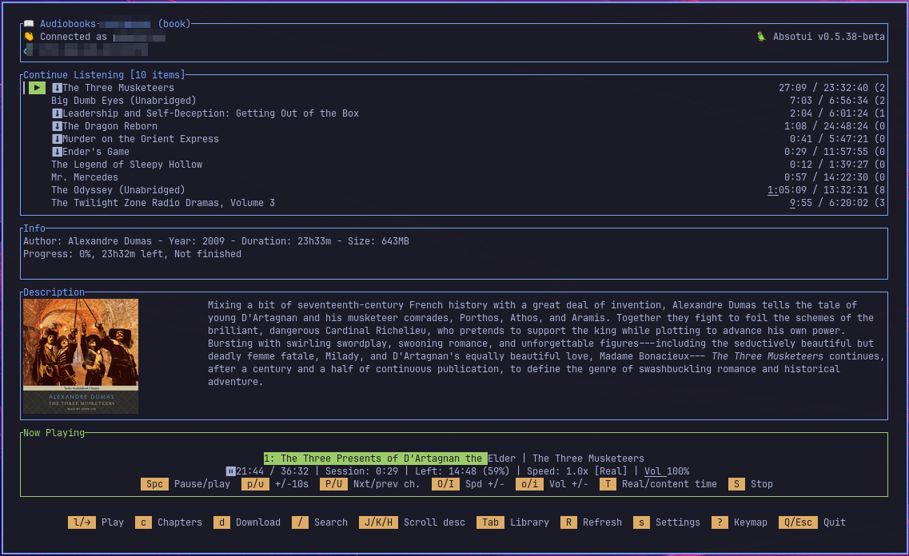

[](https://github.com/pdwaldrop/Absotui/releases/latest)
[](https://github.com/pdwaldrop/Absotui/actions/workflows/release.yml)
[](LICENSE)
[](https://www.rust-lang.org/)


<h1 align="center">
   Absotui
</h1>
<p align="center"><strong>A TUI Audiobookshelf client for Linux and macOS</strong></p>

<p align="center">
    <em>"ABS" (Audiobookshelf) + "TUI" (terminal user interface) — read it like "absolutely."</em>
</p>

<p align="center">
    
</p>

<p align="center">
    A fast, keyboard-driven terminal client for your self-hosted <a href="https://www.audiobookshelf.org/">Audiobookshelf</a> server —
    browse your library, track chapters, and keep listening progress in sync, all without leaving the terminal.
</p>

<p align="center">
  <a href="#-features">Features</a> •
  <a href="#-installation">Installation</a> •
  <a href="#%EF%B8%8F-caution-beta-version">Beta status</a> •
  <a href="#%EF%B8%8F-roadmap">Roadmap</a> •
  <a href="#-notes">More info</a>
</p>

---

## ✨ Features
- **Cross-platform:**  Linux and  macOS
- **Fast & lightweight:** a minimalist terminal user interface (TUI) written in Rust 🦀
- **Books & podcasts:** full support for both, including a unified "New & Unfinished" podcast home view and instant mark-as-finished (`F`)
- **Podcast autoplay:** automatically start the next unfinished episode when one finishes
- **Streaming or offline:** play directly, or download any book or podcast episode (`d`) for offline playback — a download is preferred automatically once you have one. Settings > Auto Download can keep your active listening downloaded automatically, and downloaded items are marked right in the list
- **Cover art:** book and podcast episode cover art shown alongside the description (terminal permitting — Kitty/Sixel/iTerm2), preferring a podcast episode's own embedded artwork over the podcast's cover when the episode's file has one
- **Chapter navigation:** browse a book's full chapter list inline in Continue Listening, with live per-chapter progress
- **Desktop integration:** a custom app icon, its own taskbar/dock window icon (on supported terminals), and a window title that shows what's currently playing
- **In-app update / uninstall:** Settings > Update / Uninstall runs the install script for you — authenticates the same way a real terminal would (fingerprint reader first, if configured, falling back to a password prompt), streams progress live, and relaunches itself on a successful update. `absotui --update`/`--uninstall` still work unchanged as a fallback
- **Customizable color theme:** a config file lets you customize the color theme, including the progress indicator color — [explore and share themes here](https://github.com/AlbanDAVID/Toutui-theme)
- **Per-item playback speed:** optionally (Settings > Per-Item Speed) let each book or podcast show remember its own playback speed instead of sharing one speed across everything
- **Reliable sync:** per-item progress bars and a now-playing marker in the Continue Listening list, accurate progress percentages even at non-1x playback speed, and a clear retry/change-server screen instead of the app just closing if Audiobookshelf is unreachable

---

## ⚠️ Caution: Beta Version
This app is still in **heavy development and contains bugs**.
❗ Please check [known bugs](known_bugs.md) — especially **major bugs** — before using the app, so you're aware of any known issues going in. If you hit something not listed there or in [Issues](https://github.com/pdwaldrop/Absotui/issues), please open a new one.

🔐 That said, you can use this app with **minimal risk** to your Audiobookshelf library. At worst, you may experience **sync issues** — there is **no risk** of data loss, deletion, or irreversible changes, since the API is only ever used to retrieve books and sync progress.

---

## 🚀 Installation

>[!WARNING]
> This is a beta app — please read [Caution: Beta Version](#%EF%B8%8F-caution-beta-version) above first, and check [Issues](https://github.com/pdwaldrop/Absotui/issues) if something goes wrong.

>[!NOTE]
> There's no AUR package for this fork yet, so `yay`/pacman won't pick up Absotui updates — use the install script below (or `absotui --update`) instead. Prebuilt binaries (Linux x86_64/aarch64, macOS universal) are available via the install script's Option 1.

### ⚡ Easy installation (install script)

**Run the following in your terminal, then follow the on-screen instructions:**

```bash
bash -c 'tmpfile=$(mktemp) && curl -LsSf https://github.com/pdwaldrop/Absotui/raw/stable/hello_absotui.sh -o "$tmpfile" && bash "$tmpfile" install && rm -f "$tmpfile"'
```

#### Update
Run `absotui --update`, or quit the app and run the following in your terminal:

```bash
bash -c 'tmpfile=$(mktemp) && curl -LsSf https://github.com/pdwaldrop/Absotui/raw/stable/hello_absotui.sh -o "$tmpfile" && bash "$tmpfile" update && rm -f "$tmpfile"'
```

#### Uninstall
Run `absotui --uninstall`, or quit the app and run the following in your terminal:

```bash
bash -c 'tmpfile=$(mktemp) && curl -LsSf https://github.com/pdwaldrop/Absotui/raw/stable/hello_absotui.sh -o "$tmpfile" && bash "$tmpfile" uninstall && rm -f "$tmpfile"'
```

#### Files installed
In `/usr/local/bin` (option 1, from install script) or `~/.cargo/bin` (option 2, from install script):
- `absotui` — the binary file

In `~/.config/absotui` (Linux) or `~/Library/Preferences` (macOS) — the default path when `XDG_CONFIG_HOME` is empty:
- `.env` — contains the secret key
- `config.toml` — configuration file
- `absotui.log` — log file
- `db.sqlite3` — SQLite database file
- `covers/` — on-disk cache of cover art (populated automatically as covers load)
- `downloads/` — books and podcast episodes downloaded for offline playback (only appears once you download something)

In `~/.local/share/applications` (Linux):
- `absotui.desktop` — lets you launch Absotui from a launcher app

<details>
<summary><h3>🔧 Install from source</h3></summary>

**Requirements:** `Rust`, `VLC`

<sub>Optional: the `cvlc_term` config setting (off by default) opens a terminal to control `cvlc` directly, which additionally needs the `kitty` terminal installed.</sub>

Note: `main` might be unstable — prefer `git clone --branch stable --single-branch https://github.com/pdwaldrop/Absotui` if you want the last stable release.

```bash
git clone https://github.com/pdwaldrop/Absotui
cd Absotui/
mkdir -p ~/.config/absotui
cp config.example.toml ~/.config/absotui/config.toml
```

Token encryption in the database (<u>**NOTE**</u>: replace `secret`):
```bash
echo ABSOTUI_SECRET_KEY=secret >> ~/.config/absotui/.env
```

```bash
cargo run --release
```

#### Update
When a new release is available:
```bash
git pull https://github.com/pdwaldrop/Absotui
cargo run --release
```

#### Notes
Run the binary directly:
```bash
cd target/release
./absotui
```

Files installed — same as above (`.env`, `config.toml`, `absotui.log`, `db.sqlite3`, `covers/`, `downloads/`), all under `~/.config/absotui`.

</details>

---

## 🛠️ Roadmap
Recent work: audiobooks split across multiple files now play, navigate chapters, and download correctly across every file, not just the first; app startup with a large podcast library is dramatically faster (roughly 17s down to 4-5s); a more reliable playback session lifecycle (quitting, switching tracks, and recovering from a crash all sync and close sessions correctly).

**Under consideration:**
- Playlist/Collections view
- Ability to add new podcasts from the app
- Stats

See [known bugs](known_bugs.md) for what's still outstanding.

---

## 📝 Notes

### 🐛 Issues
Check the [issues](https://github.com/pdwaldrop/Absotui/issues) list first, then open a new one if yours isn't there. The [original project's wiki](https://github.com/AlbanDAVID/Toutui/wiki/) can still be useful for general usage help too.

### 🤝 Contributing
Contributions of code, ideas, or feedback are welcome — see the [contributing guidelines](CONTRIBUTING.md) first.

### 🔁 Branching workflow
This project follows [this branching workflow](https://gist.github.com/digitaljhelms/4287848).

### 🎨 UI
Explore and share themes [here](https://github.com/AlbanDAVID/Toutui-theme). The font and emoji you see may vary depending on your terminal.

### 🖥️ Terminal compatibility
Absotui works in any modern terminal, but two features scale with what your terminal supports:

| Terminal | Cover art | Taskbar/dock icon & title |
|---|:---:|:---:|
| **Kitty** | ✅ Full | ✅ |
| **Ghostty** | ✅ Full | ✅ |
| **WezTerm** | ✅ Full | ✅ |
| iTerm2 (macOS) | ✅ Full | — |
| Alacritty | Fallback¹ | ✅ |
| Foot | Fallback¹ | ✅ |
| Other | Fallback¹ | Terminal default |

<sub>¹ Cover art still shows via a Unicode-block fallback instead of a real image — the terminal just doesn't speak the Kitty graphics protocol, the iTerm2 image protocol, or Sixel, which are auto-detected at startup.</sub>

**Works best overall:** **Kitty**, **Ghostty**, or **WezTerm** — full-fidelity cover art and desktop integration together.

### 🙏 Credits
Absotui began as a fork of [Toutui](https://github.com/AlbanDAVID/Toutui) by [AlbanDAVID](https://github.com/AlbanDAVID), archived in December 2025 ("I'm not able to properly maintain this project anymore... please don't wait for any new releases and issue fixing."). Thanks to the original author for the foundation this project builds on. Toutui itself took its name from the French phrase "tout ouïe" ("all ears").

### 📄 License
[GPL-3.0](LICENSE)
